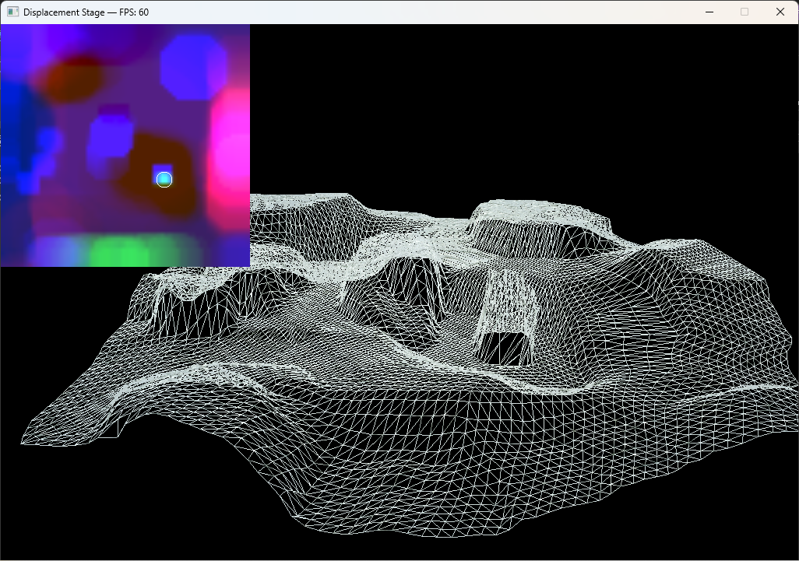

# DisplacementStage: Dynamic Displacement Mapping on GPU

> **Arquitetura extensível e de alto desempenho para geração e renderização de mapas dinâmicos de deslocamento na GPU aplicada a Jogos Digitais.**

[](https://en.cppreference.com/w/cpp/17)
[](https://www.opengl.org/)
[](https://www.khronos.org/opencl/)
[](https://cmake.org/)
[]()
[](LICENSE)

---

## 📌 Sobre o Projeto

Este repositório contém o código-fonte da arquitetura desenvolvida para gerenciar, processar e renderizar **mapas dinâmicos de deslocamento em tempo real diretamente na GPU**. A solução foi projetada de forma modular e desacoplada, utilizando **OpenCL** para processar a física da deformação do relevo e **OpenGL com Hardware Tessellation e Geometry Shaders** para renderizar a malha geométrica refinada em tempo real.

Originalmente concebido e implementado entre **2010 e 2012** como projeto de Dissertação de Mestrado em Computação Gráfica na Universidade Federal Fluminense (UFF), o projeto foi integralmente modernizado em **2026** para os padrões **C++17**, **OpenGL 4.2 Core Profile** e **OpenCL 2.0+**, eliminando dependências legadas e adotando um pipeline de compilação modular via CMake.

---

## 🏛️ Arquitetura em 3 Camadas e Separação de Responsabilidades

O sistema foi estruturado sobre o princípio de **Alta Coesão e Baixo Acoplamento**, dividindo o pipeline em três módulos bem delimitados:

1. **Displacement Generator (OpenCL):** Responsável estritamente pela física e regras matemáticas de deformação (cálculo de forças, raios de impacto, dissipação e deformação contínua).
2. **Interoperability Manager (Zero-Copy Bridge):** Gerencia a sincronização de contexto e compartilhamento direto de texturas em VRAM (`cl::Image2DGL`), eliminando o tráfego de dados pelo barramento PCIe.
3. **Displacement Manager (OpenGL):** Responsável exclusivamente pela renderização geométrica, subdivisão dinâmica de malha por hardware (*Hardware Tessellation*) e iluminação gráfica.

```
       +-------------------------------------------------------+
       |                       GPU VRAM                        |
       |                                                       |
       |  [Camada 1: Displacement Generator - OpenCL]          |
       |   • Contato / Forças / Morphing / Pincel              |
       |           │                                           |
       |           ▼ (Zero-Copy / Shared Texture)              |
       |  [Camada 2: Interoperability Bridge - cl::Image2DGL]  |
       |           │                                           |
       |           ▼                                           |
       |  [Camada 3: Displacement Manager - OpenGL 4.2 Core]   |
       |   • Vertex & Tessellation Control Shader              |
       |   • Tessellation Evaluation (Deslocamento de Malha)   |
       |   • Geometry & Fragment Shader (Normais/Iluminação)   |
       +-------------------------------------------------------+
                                   │
                                   ▼
                              [Display]
```

### 💡 Prova Histórica de Manutenibilidade (14 anos depois)
A robustez desta separação em 3 camadas foi colocada à prova durante o processo de modernização em 2026 (14 anos após a concepção original). A camada inteira de visualização e janela gráfica pôde ser substituída (removendo o framework OpenFrameworks e o Immediate Mode legado em favor de OpenGL 4.2 Core, GLFW e GLM) **sem a necessidade de alterar uma única linha de lógica dos algoritmos matemáticos ou dos kernels OpenCL (`displacementStage.cl`) originais**.

---

## 🧪 Cenas e Kernels de Validação

A arquitetura foi projetada para demonstrar a separação física/visual através de **4 cenas base** e **1 cena de prova de conceito autoral**, validando a facilidade de extensão do sistema:

### 📦 Cenas Base (Física Pré-definida)

#### 1. Contact Scene (Cena 1 - Contato)
Rastreamento e gravação contínua de marcas e trilhas deixadas por entidades móveis (esferas físicas) sobre o terreno.


#### 2. Force Scene (Cena 2 - Forças e Impactos)
Simulação paramétrica de deformações causadas por vetores de força e impulsos pontuais tridimensionais (crateras e explosões).


#### 3. Morphing Scene (Cena 3 - Transição Topológica)
Interpolação temporal contínua e fluida entre duas matrizes de relevo distintas.


---

### 🧩 Extensibilidade e Criação Autoral

#### 4. Custom Scene (Cena 4 - Esqueleto Didático de Customização)
Um modelo de partida limpo e desacoplado (princípio *Open-Closed*). Ele serve como esqueleto didático para que novos desenvolvedores implementem suas próprias lógicas físicas no OpenCL (`displacementStage.cl`) sem precisar alterar o motor gráfico principal em C++/OpenGL.


#### 5. Test Scene (Cena 5 - Prova Prática de Extensibilidade)
A prova de conceito e validação de que o esqueleto da **Cena 4** realmente funciona. Trata-se de uma ferramenta autoral completa de edição e escultura em tempo real orientada por um pincel circular interativo (deformações positivas e negativas nos canais RGB), demonstrando a implementação de uma lógica física customizada sobre a estrutura base.


---

## ⚙️ Comparativo de Modernização: 2012 vs 2026

| Recurso / Módulo | Estado Original (2012) | Estado Modernizado (2026) |
| :--- | :--- | :--- |
| **Arquitetura de Compilação** | 32-bits (x86) com Assembly inline | 64-bits (x64) nativo em C++17 |
| **Gerenciador de Janela e Loop** | OpenFrameworks 0071 + GLUT legados | GLFW 3.5 puro e desacoplado |
| **Pipeline Gráfico (OpenGL)** | OpenGL 4.0 (Immediate Mode / Funções Fixas) | OpenGL 4.2 Core Profile nativo |
| **Envio de Geometria** | `glBegin(GL_PATCHES)` / `glEnd()` legados | VAO (Vertex Array) e VBO (VertexBuffer) |
| **Cálculos Matemáticos** | Matrizes legadas (`glMatrixMode`, `gluPerspective`) | GLM (OpenGL Mathematics) otimizada |
| **Shader Language** | GLSL legado com variáveis embutidas | GLSL 420 Core com uniform blocks e layouts explícitos |
| **OpenCL API** | Wrapper `cl.hpp` obsoleto (OpenCL 1.1) | Wrapper `opencl.hpp` moderno (OpenCL 2.0+) |
| **Carregamento de Texturas** | Classe proprietária `ofImage` (OpenFrameworks) | `stb_image.h` nativo em C/C++ |
| **Cálculo de Tempo** | Função interna `ofGetElapsedTimeMillis()` | `std::chrono` da biblioteca padrão C++ |
| **Gerenciamento de Build** | Solução estática do Visual Studio 2010 | CMake 3.20+ integrado ao vcpkg |

---

## 🎮 Guia de Controles (Teclado e Mouse)

### Navegação Geral
* **`1` a `5`:** Alterna entre as cenas de validação dos kernels.
* **`Espaço`:** Retorna ao Menu Principal (Cena 0).
* **`ESC`:** Fecha a aplicação imediatamente.

### Câmera, Visualização e Depuração
* **`Botão do Meio do Mouse (Scroll Press) + Arrastar`:** Orbita a câmera livremente ao redor do terreno (câmera esférica/Arcball). Nos menus e nas Cenas 1-4, arrastar com o clique esquerdo ou direito também orbita.
* **`Scroll do Mouse`:** Dá zoom (aproxima/afasta) na câmera. Na **Cena 5 (Test Scene)**, segure a tecla **`Ctrl` + Scroll** para dar zoom.
* **`Setas (↑ ↓ ← →)` / `WASD`:** Movem o alvo/foco da câmera ao longo do plano do solo, deslocando todo o sistema orbital.
* **`W`:** Alterna a exibição em modo *Wireframe* (linhas de grade).
* **`R`:** Liga/Desliga a rotação automática da malha 3D.
* **`P`:** Pausa/Retoma o cálculo de deformação física no OpenCL.
* **`S`:** Salva captura em alta definição (.png) da textura de deformação atual na pasta `bin/data/dmap/`.
* **`D`:** Ativa/Desativa o modo de depuração visual (exibe o mini-mapa 2D no canto da tela com a textura de deslocamento na VRAM compartilhada). Esta visualização geral foi implementada utilizando o padrão de projeto **Decorator**, permitindo inspecionar em tempo real o buffer de textura que influencia a deformação da malha 3D em qualquer uma das cenas.

### Escultura e Pincel Interativo (Cena 5 - Test Scene)
* **`Scroll do Mouse` ou `+ / -`:** Ajusta o raio de ação do pincel de deformação (sem segurar Ctrl).
* **`Clique Esquerdo + Arrastar`:** Aplica deformação positiva (elevação/escultura do relevo).
* **`Clique Direito + Arrastar`:** Aplica deformação negativa (depressão/escultura de cratera).
* **`8`, `9` ou `0`:** Modifica a deformação física do canal selecionado (Vermelho, Verde ou Azul).

### Controle de Tesselação Dinâmica (GPU)
* **`F1` / `F2`:** Diminui / Aumenta o fator de Tessellation Interno.
* **`F3` / `F4`:** Diminui / Aumenta o fator de Tessellation Externo.
* **`F5` / `F6`:** Ajusta ambos os fatores simultaneamente.

---

## 🛠️ Como Compilar e Executar

### Pré-requisitos
* **Visual Studio 2022** (com suporte a Desktop C++).
* **CMake 3.20+** instalado.
* **vcpkg** instalado e configurado globalmente (`vcpkg integrate install`).
* **Driver NVIDIA com suporte a OpenCL** (ou NVIDIA CUDA Toolkit).

### Opção 1: Compilação via Terminal (CMake)

```bash
# 1. Configurar o diretório de build apontando para o toolchain do vcpkg
cmake -B build -S . -DCMAKE_TOOLCHAIN_FILE=[Caminho/Para/vcpkg]/scripts/buildsystems/vcpkg.cmake

# 2. Compilar o executável otimizado em Release
cmake --build build --config Release

# 3. Executar o binário gerado
./build/Release/DisplacementStage.exe
```

### Opção 2: Pelo Visual Studio 2022 (IDE)
1. Abra a solução gerada em `build/DisplacementStage.sln` no Visual Studio 2022.
2. No *Solution Explorer*, clique com o botão direito no projeto **`DisplacementStage`** e selecione **"Set as Startup Project"**.
3. Altere o modo de build no menu superior para **`Release`** (`x64`).
4. Pressione **`F5`** (ou clique em *Local Windows Debugger*). O diretório de trabalho é configurado automaticamente pelo CMake para encontrar a pasta `data/`.

---

## 📂 Estrutura do Repositório

```
DisplacementStage/
├── bin/data/              # Recursos de runtime (fontes, texturas, kernels)
│   ├── fonts/             # Fontes (.ttf)
│   ├── kernels/           # Simulação física em OpenCL (.cl)
│   ├── textures/          # Texturas e mapas de altura (.png)
│   └── dmap/              # Capturas de tela históricas
├── docs/                  # Dissertação de Mestrado e artigos científicos
│   ├── dissertacao_FCA.pdf
│   └── sbgames_FCA.pdf
├── src/                   # Código-fonte em C++ (Lógica do Motor & Cenas)
│   ├── DisplacementStage.cpp
│   └── ...
├── vendor/                # Dependências de cabeçalho único (stb_image, etc.)
├── CMakeLists.txt         # Configuração de build multiplataforma
└── README.md              # Documentação principal
```

---

## 📚 Documentação Científica Oficial

Os arquivos científicos originais do mestrado estão catalogados e linkados na pasta `/docs`:
* 📄 **Dissertação de Mestrado (PDF):** [docs/dissertacao_FCA.pdf](docs/dissertacao_FCA.pdf)
* 📄 **Artigo Científico SBGames (PDF):** [docs/sbgames_FCA.pdf](docs/sbgames_FCA.pdf)

---

## 📚 Publicações e Citação

Caso este projeto ou os conceitos desta arquitetura sejam utilizados em pesquisas acadêmicas ou projetos técnicos, utilize a citação abaixo:

```bibtex
@mastersthesis{andrade2012displacement,
  title     = {Arquitetura extensível para mapas dinâmicos de deslocamento na GPU em jogos digitais},
  author    = {Andrade, Fábio C.},
  year      = {2012},
  school    = {Universidade Federal Fluminense (UFF)},
  address   = {Niterói, RJ, Brasil}
}
```

---

## 📄 Licença

Este projeto é distribuído sob a licença [MIT](LICENSE).
